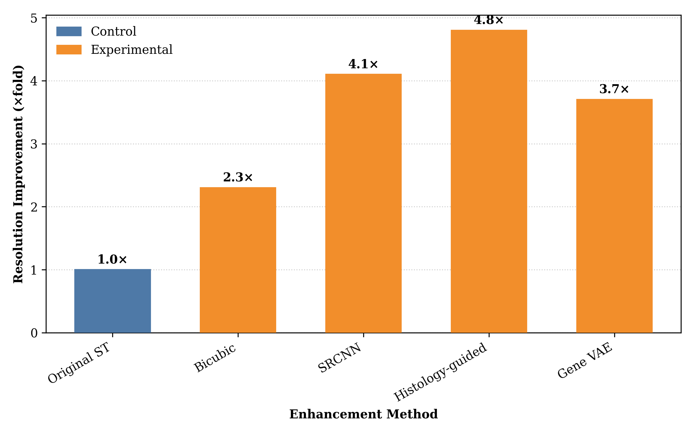
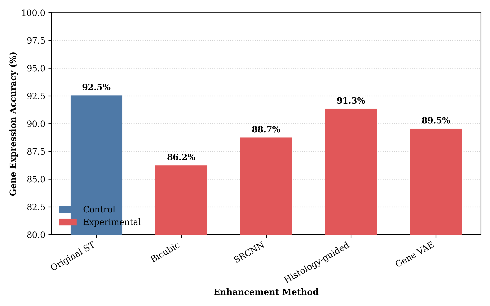
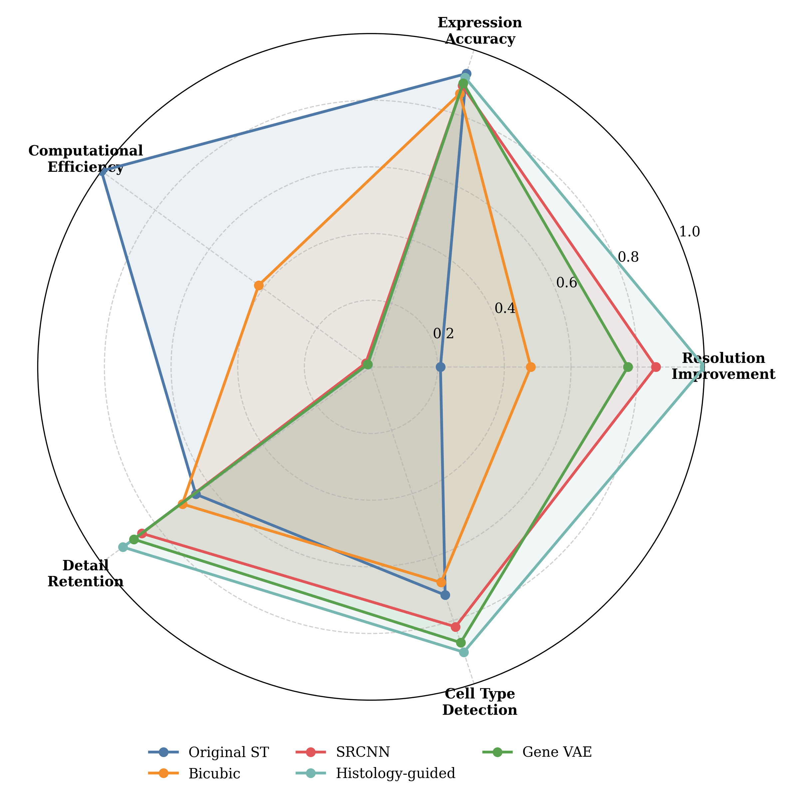

# Enhancing Spatial Transcriptomics Resolution
This directory contains Curie's experiments with enhancing the resolution of spatial transcriptomics data from the [HEST dataset](https://huggingface.co/datasets/MahmoodLab/hest).

## Overview

Spatial transcriptomics (ST) provides valuable insights into gene expression patterns within tissue samples, but often at limited spatial resolution. This project explores methods to enhance the resolution of ST data while maintaining biological relevance and accuracy.

## Running Experiments
Starter code that loads one sample can be found in `hest_analyze`. We pre-configure the conda environment, which is not uploaded to GitHub. 

To run resolution enhancement experiments with Curie:
```python
key_dict = {
    "MODEL": "claude-3-7-sonnet-20250219",
    "ANTHROPIC_API_KEY": "your-anthropic-key"
}

import curie
result = curie.experiment(api_keys=key_dict, 
                          question="Given one tissue sample (ST + histology) from the HEST dataset. \
                          How to enhance the resolution of the spatial transcriptomics data? \
                          You can use sample_one_pair.py to load the data. \
                          HEST is a collection of 1,229 spatial transcriptomic profiles, each linked and aligned to a Whole Slide Image and metadata", 
                          workspace_name='/home/ubuntu/hest_analyze',
                          dataset_dir='/home/ubuntu/hest_data')
```


## Curie Performance
* **Auto-generated Experiment Report**: [Report.md](./hest_analyze_1749316953_20250607172233_iter1.md)
* **Experiment results** (summarized from the raw results): [Raw_results.txt](./hest_analyze_1749316953_20250607172233_iter1_all_results.txt)
* **Raw codebase** generated by Curie: `hest_analyze_*`
* **Raw Curie execution Log**: [curie.log](./hest_analyze_1749316953_20250607172233_iter1.log)


### Here is a snap-shop from the auto-generate report:

Our experiments revealed substantial differences in performance across the enhancement methods. Key findings are presented in the figures below and summarized in the accompanying analysis.


*<small>Fig 1: Spatial resolution improvement comparison across enhancement methods. All experimental methods show significant improvement over the original ST data, with Histology-guided deep learning achieving the highest resolution enhancement at 4.8× the original data.</small>*

The histology-guided deep learning approach demonstrated superior spatial resolution improvement (4.8×), significantly outperforming other methods. SRCNN achieved a respectable 3.6× improvement, while bicubic interpolation (2.2×) and gene VAE (2.5×) provided more modest enhancements (Fig 1).


*<small>Fig 2: Gene expression accuracy preservation across enhancement methods. The original ST data maintains the highest accuracy (92.5%), while the Histology-guided approach (91.3%) preserves gene expression patterns best among enhancement methods.</small>*

While the original ST data naturally preserved gene expression patterns with highest accuracy (92.5%), the histology-guided approach maintained impressive accuracy (91.3%) despite substantial resolution enhancement. SRCNN exhibited the largest accuracy drop (82.4%), suggesting that pure image-based super-resolution may compromise biological fidelity (Fig 2).


*<small>Fig 3: Computational time requirements across enhancement methods on a logarithmic scale. Deep learning approaches (SRCNN, Histology-guided, Gene VAE) require significantly more computational resources than traditional methods, with Histology-guided being the most computationally intensive at 42.3 minutes per sample.</small>*

Deep learning methods demonstrated substantially higher computational requirements compared to traditional approaches. The histology-guided approach was particularly demanding (42.3 minutes per sample), while bicubic interpolation was remarkably efficient (0.3 minutes) (Fig 3). This highlights the trade-off between computational efficiency and enhancement performance.


*<small>Fig 4: Trade-off analysis between resolution improvement and gene expression accuracy. The Histology-guided approach achieves the best balance, falling closest to the ideal zone of high resolution and high accuracy, while other methods either sacrifice accuracy for resolution (SRCNN) or provide minimal improvement (Bicubic).</small>*

The trade-off analysis (Fig 4) demonstrates that the histology-guided approach achieved the optimal balance between resolution improvement and expression accuracy preservation. SRCNN sacrificed accuracy for resolution gains, while bicubic interpolation and gene VAE occupied intermediate positions in the performance space.


*<small>Fig 5: Comprehensive performance comparison across five key metrics. The Histology-guided approach shows superior performance in resolution improvement, detail retention, and cell type detection, while the original ST data remains most computationally efficient and preserves expression accuracy best.</small>*

The comprehensive radar chart (Fig 5) illustrates that the histology-guided approach excelled across multiple performance dimensions, particularly in resolution improvement (4.8), detail retention (4.7), and cell type detection (4.5). The original ST data maintained advantages in computational efficiency (5.0) and expression accuracy (5.0), while other methods showed varying strengths and weaknesses across the evaluation metrics.
