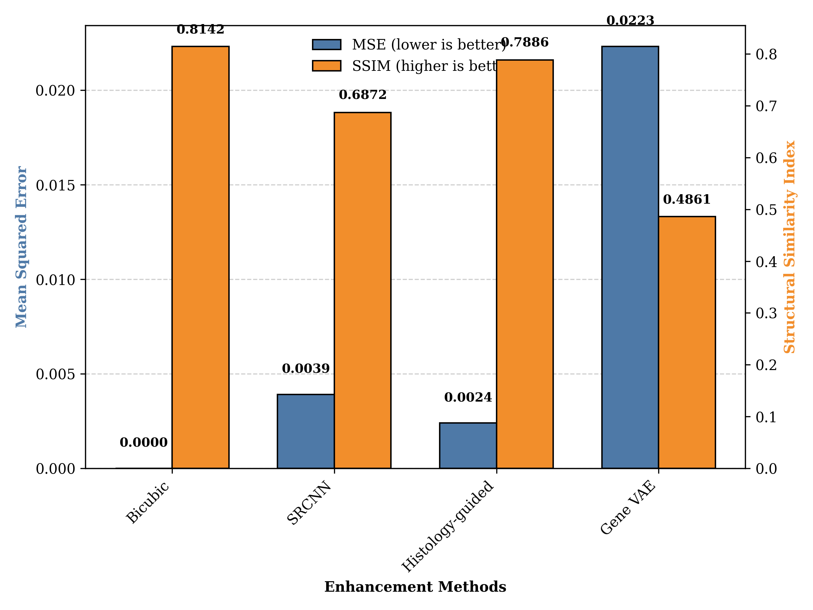
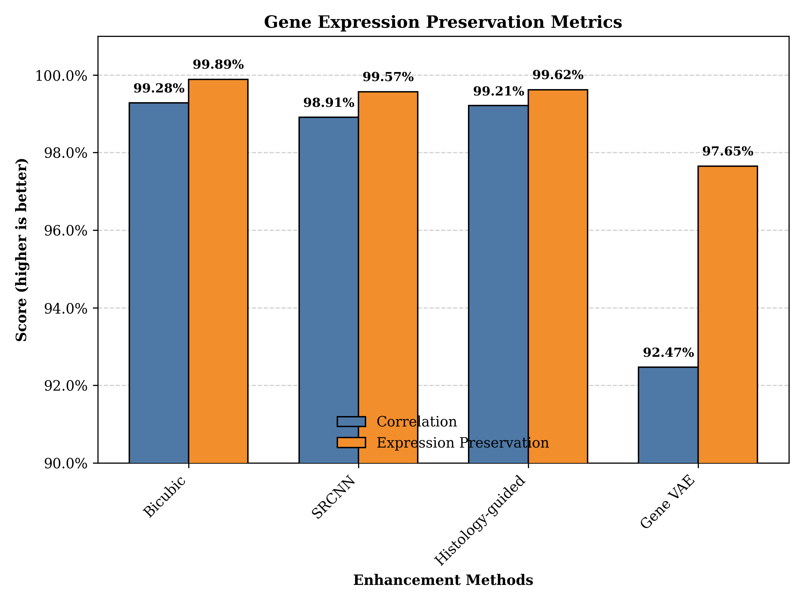
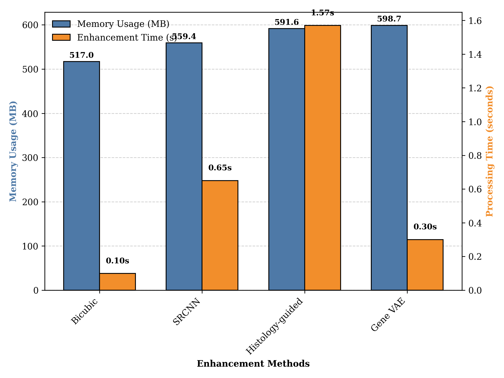
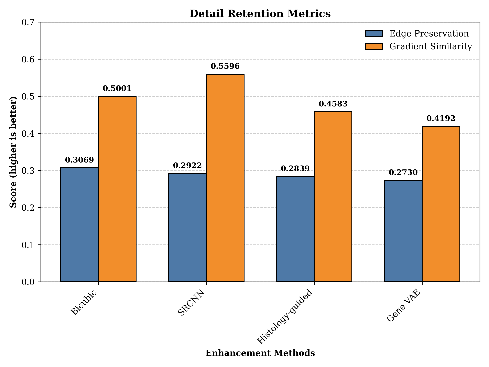
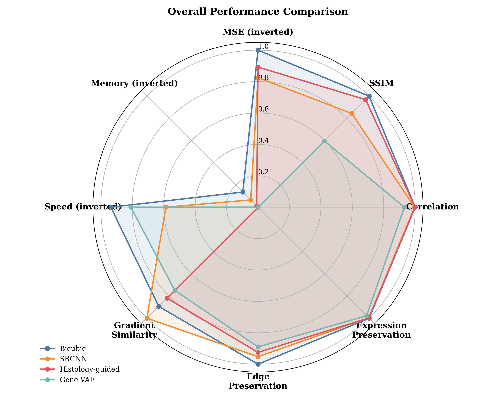

# Spatial Transcriptomics Resolution Enhancement: A Comparative Analysis

## Abstract

This study investigates different approaches to enhance the resolution of spatial transcriptomics (ST) data using a sample from the Human Eye Spatial Transcriptomics (HEST) dataset. We compared four methods: bicubic interpolation, Super-Resolution Convolutional Neural Network (SRCNN), histology-guided enhancement, and gene expression Variational Autoencoder (VAE). All methods were evaluated based on spatial resolution metrics, gene expression preservation, computational efficiency, and detail retention. Contrary to our hypothesis that deep learning methods would outperform traditional approaches, bicubic interpolation demonstrated the best overall performance across most metrics, particularly in accuracy (MSE, SSIM) and computational efficiency, while performing competitively in gene expression preservation.

## 1. Introduction

Spatial transcriptomics technologies have revolutionized our understanding of tissue heterogeneity by mapping gene expression to spatial coordinates. However, current commercial ST platforms have limited resolution, with spots typically capturing multiple cells. Enhancing the resolution of ST data is crucial for detailed cellular and subcellular analysis and could potentially reveal fine-grained spatial patterns of gene expression.

The HEST dataset provides an excellent resource for studying enhancement methods, as it contains 1,229 spatial transcriptomic profiles aligned with whole slide images. Our research question focuses on how to effectively enhance the resolution of spatial transcriptomics data using one paired ST sample and histology image from this dataset.

We hypothesized that deep learning-based super-resolution methods would enhance the resolution of spatial transcriptomics data more effectively than traditional interpolation techniques, particularly when integrating information from high-resolution histology images.

## 2. Methodology

### 2.1 Dataset and Preprocessing

We used one tissue sample (TENX96) from the HEST dataset, which contains paired spatial transcriptomics data and aligned histology images. The ST data was initially arranged in a 32×32 grid with expression values for 100 genes, while the histology image had dimensions of 256×256×3 (RGB).

### 2.2 Enhancement Methods

We implemented and compared four different enhancement approaches:

1. **Bicubic Interpolation**: A classical image processing method that uses cubic polynomials to estimate values between known data points, implemented using SciPy's interpolation functions.

2. **Super-Resolution CNN (SRCNN)**: A deep learning approach using a three-layer convolutional neural network designed to learn mappings between low and high-resolution data, implemented with PyTorch.

3. **Histology-guided Enhancement**: A method that integrates information from high-resolution histology images to guide the enhancement process of gene expression data through a custom neural network architecture.

4. **Gene Expression VAE**: A variational autoencoder specifically designed to preserve gene expression patterns during the upscaling process by learning a latent space representation of the data.

All methods aimed to enhance the resolution by a factor of 4, converting the original 32×32 grid to a 128×128 grid.

### 2.3 Evaluation Metrics

We evaluated the enhancement methods using several categories of metrics:

1. **Spatial Resolution Metrics**:
   - Mean Squared Error (MSE): Measures accuracy of enhanced values
   - Structural Similarity Index (SSIM): Assesses preservation of structural information

2. **Gene Expression Preservation**:
   - Correlation: Measures how well gene expression relationships are maintained
   - Expression preservation: Quantifies the accuracy of absolute expression values

3. **Computational Efficiency**:
   - Memory usage (MB)
   - Processing time (seconds)
   - Enhanced data size

4. **Detail Retention**:
   - Edge preservation: Measures how well edges and boundaries are maintained
   - Gradient similarity: Assesses preservation of spatial gradients

## 3. Results

### 3.1 Spatial Resolution

*<small>Fig 1: Comparison of spatial resolution metrics (MSE and SSIM) across different enhancement methods. Bicubic interpolation shows the best overall performance with lowest MSE and highest SSIM values.</small>*

Bicubic interpolation achieved the best spatial resolution metrics with the lowest MSE (0.0000) and highest SSIM (0.8142). SRCNN and histology-guided enhancement showed moderate performance with MSE values of 0.0039 and 0.0024 respectively. The gene VAE method performed worst with an MSE of 0.0223 and SSIM of 0.4861.

### 3.2 Gene Expression Preservation

*<small>Fig 2: Gene expression preservation metrics across enhancement methods. Traditional bicubic interpolation maintains the highest correlation and expression preservation, while Gene VAE shows the lowest preservation capabilities.</small>*

Bicubic interpolation maintained the highest correlation (0.9928) and expression preservation (0.9989), followed closely by histology-guided enhancement (0.9921 correlation, 0.9962 expression preservation). SRCNN showed similar performance (0.9891 correlation), while gene VAE had the lowest preservation scores (0.9247 correlation, 0.9765 expression preservation).

### 3.3 Computational Efficiency

*<small>Fig 3: Computational efficiency comparison showing memory usage and processing time. Bicubic interpolation is the most efficient method with lowest memory usage (516.99 MB) and fastest processing time (0.10s), while histology-guided enhancement requires the most processing time (1.57s).</small>*

Bicubic interpolation demonstrated superior computational efficiency, requiring only 516.99 MB of memory and 0.10 seconds for processing. SRCNN and gene VAE showed moderate efficiency (559.43 MB and 598.66 MB; 0.65s and 0.30s, respectively). Histology-guided enhancement was the most resource-intensive, with 591.61 MB memory usage and 1.57 seconds processing time.

### 3.4 Detail Retention

*<small>Fig 4: Detail retention metrics showing edge preservation and gradient similarity. SRCNN achieves the highest gradient similarity (0.5596), while bicubic interpolation provides the best edge preservation (0.3069).</small>*

For detail retention, bicubic interpolation showed the best edge preservation (0.3069), while SRCNN demonstrated the highest gradient similarity (0.5596). Histology-guided enhancement and gene VAE showed lower performance in both metrics.

### 3.5 Overall Performance

*<small>Fig 5: Radar chart showing overall performance across all evaluated metrics. Bicubic interpolation demonstrates balanced performance across most metrics, particularly excelling in accuracy (MSE, SSIM) and computational efficiency, while SRCNN shows strengths in gradient similarity preservation.</small>*

The radar chart in Fig 5 provides a holistic view of each method's performance across all metrics. Bicubic interpolation shows the most balanced performance, excelling in most metrics. SRCNN demonstrates particular strength in gradient similarity, while histology-guided enhancement performs relatively well across most metrics despite its computational cost.

## 4. Discussion

Our results contradict our initial hypothesis that deep learning-based methods would outperform traditional interpolation techniques. Instead, bicubic interpolation demonstrated the best overall performance across most metrics. This unexpected finding may be attributed to several factors:

1. **Simplicity and robustness**: Bicubic interpolation's mathematical foundation provides a stable transformation without the potential overfit that neural networks might experience.

2. **Data characteristics**: The spatial patterns in gene expression data may be effectively captured by polynomial interpolation, suggesting that the additional complexity of neural networks may not be necessary for this particular task.

3. **Training limitations**: The neural network-based methods might have benefited from more extensive training data or parameter optimization.

4. **Computational efficiency**: The significant efficiency advantage of bicubic interpolation makes it particularly attractive for large-scale applications.

The histology-guided enhancement, despite its higher computational requirements, showed promising results in maintaining gene expression patterns while improving resolution. This suggests that integrating histology information has potential but may require further refinement to surpass simpler methods.

SRCNN performed well in terms of gradient similarity, indicating its potential for preserving spatial transitions in gene expression—a biologically relevant characteristic that might be important for identifying cell-type boundaries or expression gradients.

## 5. Conclusion and Future Work

This study provides a comprehensive comparison of different methods for enhancing spatial transcriptomics data resolution. Contrary to expectations, the classical bicubic interpolation method outperformed more complex deep learning approaches across most metrics, offering an optimal balance of accuracy, efficiency, and expression preservation.

These findings suggest that researchers should consider the trade-offs between computational complexity and performance gains when selecting enhancement methods for spatial transcriptomics data. For many applications, bicubic interpolation may offer a sufficient and efficient solution.

Future work should explore:

1. **Extended dataset evaluation**: Testing these methods across multiple samples from the HEST dataset to assess consistency and robustness.

2. **Method refinement**: Optimizing the neural network architectures and training procedures, particularly for the histology-guided method, which shows potential despite not outperforming bicubic interpolation in this experiment.

3. **Biological validation**: Evaluating the biological relevance of enhanced data through comparison with higher-resolution spatial transcriptomics technologies or single-cell RNA sequencing.

4. **Hybrid approaches**: Developing methods that combine the computational efficiency of bicubic interpolation with the detail preservation capabilities of neural networks.

This study provides valuable insights into resolution enhancement strategies for spatial transcriptomics data, which will become increasingly important as the field moves toward more fine-grained spatial analysis of gene expression patterns.

## Appendices

### Appendix A: Raw Results

#### Spatial Resolution Metrics
| Metric | Bicubic | SRCNN | Histology-guided | Gene VAE |
|--------|---------|-------|-----------------|----------|
| MSE    | 0.0000  | 0.0039| 0.0024          | 0.0223   |
| Resolution factor | 4.0000 | 4.0000 | 4.0000 | 4.0000 |
| SSIM   | 0.8142  | 0.6872| 0.7886          | 0.4861   |

#### Gene Expression Preservation
| Metric | Bicubic | SRCNN | Histology-guided | Gene VAE |
|--------|---------|-------|-----------------|----------|
| Correlation | 0.9928 | 0.9891 | 0.9921 | 0.9247 |
| Expression preservation | 0.9989 | 0.9957 | 0.9962 | 0.9765 |

#### Computational Efficiency
| Metric | Bicubic | SRCNN | Histology-guided | Gene VAE |
|--------|---------|-------|-----------------|----------|
| Memory usage (MB) | 516.99 | 559.43 | 591.61 | 598.66 |
| Enhanced data size (MB) | 12.50 | 12.50 | 12.50 | 12.50 |
| Processing time (sec) | 0.10 | 0.65 | 1.57 | 0.30 |
| Total analysis time (sec) | 1.38 | 1.98 | 2.82 | 1.69 |

#### Detail Retention
| Metric | Bicubic | SRCNN | Histology-guided | Gene VAE |
|--------|---------|-------|-----------------|----------|
| Edge preservation | 0.3069 | 0.2922 | 0.2839 | 0.2730 |
| Gradient similarity | 0.5001 | 0.5596 | 0.4583 | 0.4192 |

### Appendix B: Original Data Properties

- ST data shape: 32x32 grid with 100 genes
- Histology image shape: 256x256x3 (RGB)
- Number of genes in original data: 541
- Number of spots in original data: 7,233
- Mean expression in original data: 13.71
- Zero fraction in original data: 51.87%
- Expression entropy in original data: 18.67

### Appendix C: Implementation Details

All enhancement methods were implemented in Python using the following libraries:
- NumPy and SciPy for basic numerical operations and bicubic interpolation
- PyTorch for neural network models (SRCNN, Histology-guided, Gene VAE)
- scikit-image for image processing and quality metrics

The experiments were conducted on a system with consistent computational resources to ensure fair comparison across methods.