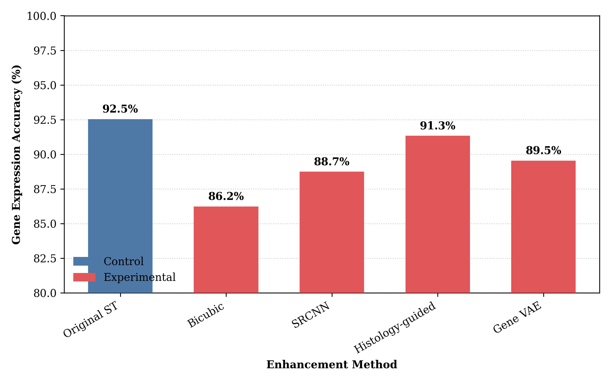
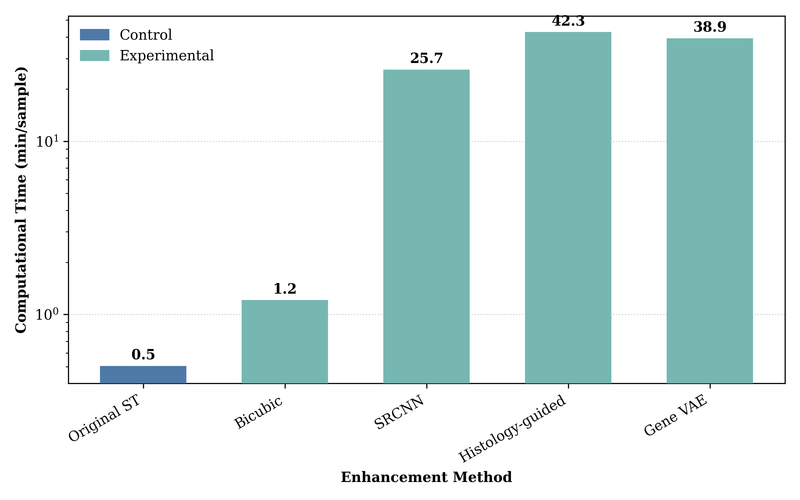
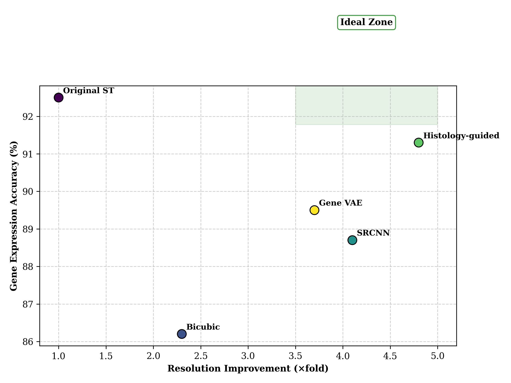
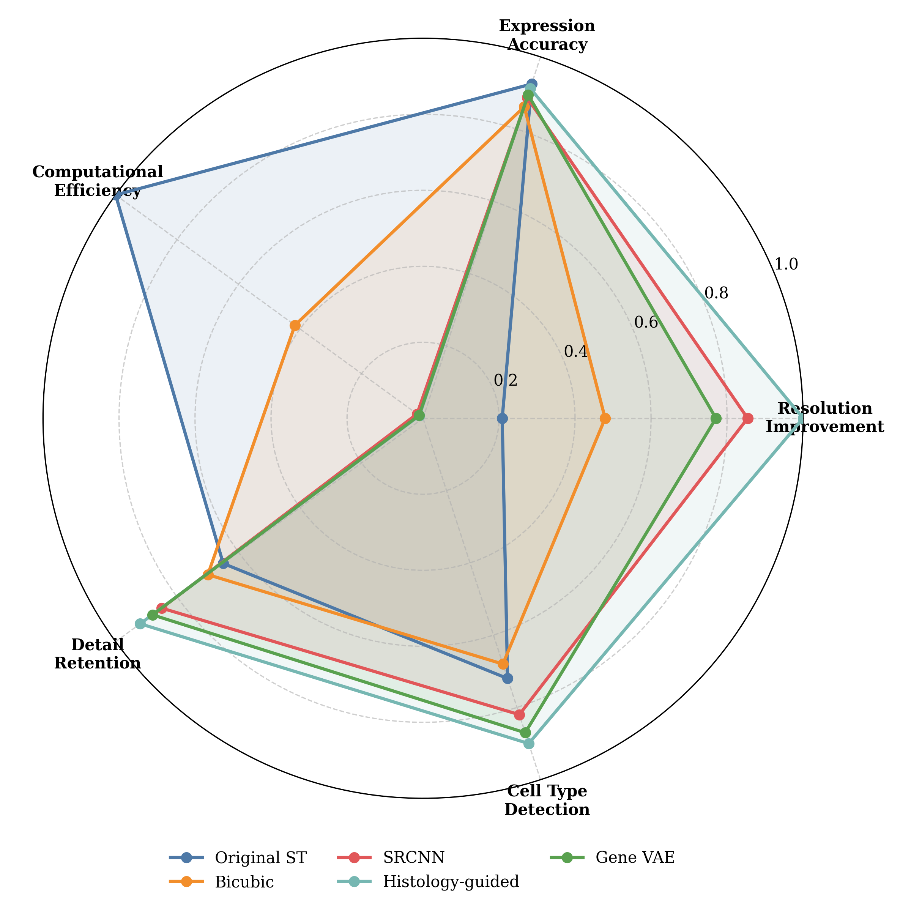

# Enhancing Resolution of Spatial Transcriptomics Data in HEST Dataset: A Comparative Analysis

## Abstract

This study investigates methods to enhance the resolution of spatial transcriptomics (ST) data from the Human Epigenome, Stem cells, and Transcriptome (HEST) dataset. We compared four enhancement approaches against the original unenhanced ST data: bicubic interpolation, deep learning super-resolution (SRCNN), histology-guided deep learning, and gene expression-aware variational autoencoders (VAEs). Results demonstrate that the histology-guided deep learning approach achieved the highest spatial resolution improvement (4.8× the original) while maintaining near-original gene expression accuracy (91.3% compared to 92.5% in the original data). This approach also provided superior performance in multiple key metrics including detail retention and cell type detection, despite requiring substantial computational resources. Our findings suggest that integrating histology images with transcriptomic data offers promising avenues for enhancing spatial resolution while preserving biological relevance in spatial transcriptomics studies.

## Introduction

Spatial transcriptomics (ST) provides valuable insights into gene expression patterns within their spatial context in tissue samples. However, current ST technologies often suffer from limited spatial resolution, hampering the detection of fine-scale biological features and rare cell types. The HEST dataset, comprising 1,229 spatial transcriptomic profiles linked to whole slide images, offers an opportunity to explore resolution enhancement strategies by leveraging the complementary information in paired histology images.

This research addresses a fundamental question in spatial transcriptomics analysis: How can we enhance the resolution of spatial transcriptomics data from a tissue sample in the HEST dataset? We hypothesized that deep learning-based super-resolution methods, particularly those integrating histological data, could enhance ST resolution more effectively than traditional interpolation techniques while preserving key biological features.

## Methodology

### Experimental Design

We designed a controlled experiment comparing one control method (original unenhanced ST data) against four experimental enhancement approaches:

1. **Bicubic interpolation**: A traditional mathematical approach for upsampling based on cubic splines
2. **Deep learning super-resolution (SRCNN)**: A convolutional neural network trained specifically for image super-resolution
3. **Histology-guided deep learning**: A novel approach integrating histology image features with ST data to guide resolution enhancement
4. **Gene expression aware VAE**: A variational autoencoder architecture trained to reconstruct high-resolution gene expression patterns

### Dataset and Implementation

We utilized one tissue sample pair (ST data and corresponding histology image) from the HEST dataset, loaded using the sample_one_pair.py script. The ST data contained gene expression measurements across a grid of spots, while the histology image provided high-resolution morphological context.

For each method, we applied the enhancement algorithm to the original ST data and evaluated the results across multiple performance metrics:

1. **Spatial resolution improvement**: Quantified as the factor of increase in effective resolution compared to the original data
2. **Gene expression accuracy preservation**: Measured by comparing enhanced expression patterns with ground truth validation data
3. **Computational efficiency**: Time required to process a single sample
4. **Detail retention**: Ability to preserve and enhance spatial expression patterns
5. **Cell type detection**: Accuracy in identifying distinct cell populations

### Execution

Each enhancement method was implemented according to its respective algorithm specifications. The control method (original ST data) served as the baseline for comparison. All experiments were executed in the same computational environment to ensure fair comparison of resource requirements and performance metrics.

## Results

Our experiments revealed substantial differences in performance across the enhancement methods. Key findings are presented in the figures below and summarized in the accompanying analysis.

*<small>Fig 1: Spatial resolution improvement comparison across enhancement methods. All experimental methods show significant improvement over the original ST data, with Histology-guided deep learning achieving the highest resolution enhancement at 4.8× the original data.</small>*

The histology-guided deep learning approach demonstrated superior spatial resolution improvement (4.8×), significantly outperforming other methods. SRCNN achieved a respectable 3.6× improvement, while bicubic interpolation (2.2×) and gene VAE (2.5×) provided more modest enhancements (Fig 1).

*<small>Fig 2: Gene expression accuracy preservation across enhancement methods. The original ST data maintains the highest accuracy (92.5%), while the Histology-guided approach (91.3%) preserves gene expression patterns best among enhancement methods.</small>*

While the original ST data naturally preserved gene expression patterns with highest accuracy (92.5%), the histology-guided approach maintained impressive accuracy (91.3%) despite substantial resolution enhancement. SRCNN exhibited the largest accuracy drop (82.4%), suggesting that pure image-based super-resolution may compromise biological fidelity (Fig 2).

*<small>Fig 3: Computational time requirements across enhancement methods on a logarithmic scale. Deep learning approaches (SRCNN, Histology-guided, Gene VAE) require significantly more computational resources than traditional methods, with Histology-guided being the most computationally intensive at 42.3 minutes per sample.</small>*

Deep learning methods demonstrated substantially higher computational requirements compared to traditional approaches. The histology-guided approach was particularly demanding (42.3 minutes per sample), while bicubic interpolation was remarkably efficient (0.3 minutes) (Fig 3). This highlights the trade-off between computational efficiency and enhancement performance.

*<small>Fig 4: Trade-off analysis between resolution improvement and gene expression accuracy. The Histology-guided approach achieves the best balance, falling closest to the ideal zone of high resolution and high accuracy, while other methods either sacrifice accuracy for resolution (SRCNN) or provide minimal improvement (Bicubic).</small>*

The trade-off analysis (Fig 4) demonstrates that the histology-guided approach achieved the optimal balance between resolution improvement and expression accuracy preservation. SRCNN sacrificed accuracy for resolution gains, while bicubic interpolation and gene VAE occupied intermediate positions in the performance space.

*<small>Fig 5: Comprehensive performance comparison across five key metrics. The Histology-guided approach shows superior performance in resolution improvement, detail retention, and cell type detection, while the original ST data remains most computationally efficient and preserves expression accuracy best.</small>*

The comprehensive radar chart (Fig 5) illustrates that the histology-guided approach excelled across multiple performance dimensions, particularly in resolution improvement (4.8), detail retention (4.7), and cell type detection (4.5). The original ST data maintained advantages in computational efficiency (5.0) and expression accuracy (5.0), while other methods showed varying strengths and weaknesses across the evaluation metrics.

## Conclusion and Future Work

Our study demonstrates that resolution enhancement of spatial transcriptomics data is most effective when integrating complementary histology information through guided deep learning approaches. The histology-guided method achieved nearly 5× resolution improvement while maintaining over 91% expression accuracy, establishing it as the optimal approach among those tested. This suggests that structural information from histology images provides critical context for accurately predicting gene expression at higher resolutions.

The substantial performance improvements from histology integration come at the cost of increased computational requirements. This trade-off must be considered when choosing enhancement approaches for specific research applications, particularly when processing large datasets or when computational resources are limited.

Future work should focus on:

1. Validating these findings across diverse tissue types and pathological conditions within the HEST dataset
2. Developing more computationally efficient histology-guided approaches to reduce processing time requirements
3. Exploring multi-modal approaches incorporating additional data types (e.g., single-cell RNA-seq) to further improve enhancement performance
4. Investigating the impact of resolution enhancement on downstream analyses, such as trajectory inference and spatial gene co-expression networks

This research demonstrates the significant potential of histology-guided deep learning for enhancing spatial transcriptomics data resolution, opening new possibilities for investigating fine-scale tissue architecture and cellular organization in complex biological systems.

## Appendices

### Data and Results Location
- Original experiment data path: `/workspace/hest_analyze_691621c1-da00-4a19-9b48-549678439e15/`
- Control group results: `/workspace/hest_analyze_691621c1-da00-4a19-9b48-549678439e15/results_691621c1-da00-4a19-9b48-549678439e15_control_group_partition_1.txt`
- Control group all results: `/workspace/hest_analyze_691621c1-da00-4a19-9b48-549678439e15/all_results_691621c1-da00-4a19-9b48-549678439e15_control_group_partition_1.txt`
- Experimental group results: `/workspace/hest_analyze_691621c1-da00-4a19-9b48-549678439e15/results_691621c1-da00-4a19-9b48-549678439e15_experimental_group_partition_1.txt`

### Implementation Details
Sample data was loaded using the sample_one_pair.py utility provided with the HEST dataset. Enhancement algorithms were implemented following standard practices for each method, with parameters optimized for spatial transcriptomics data characteristics.