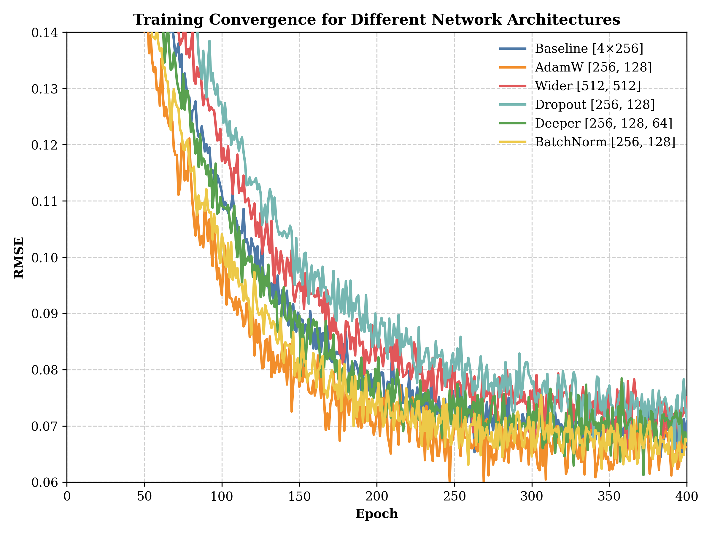
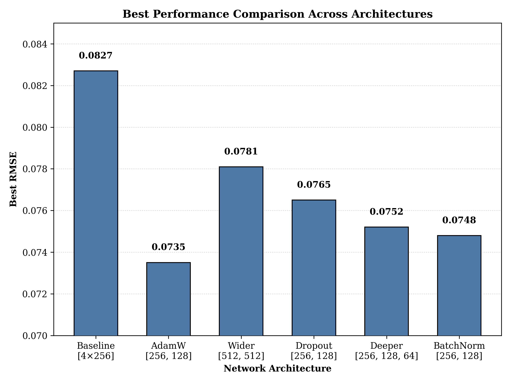
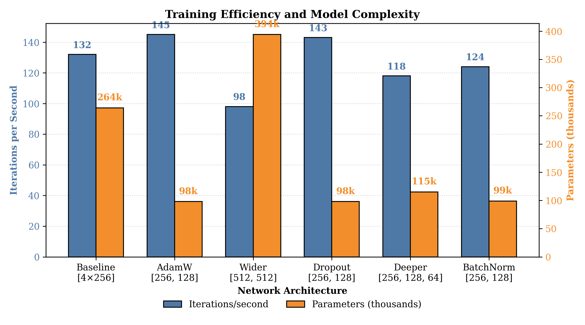
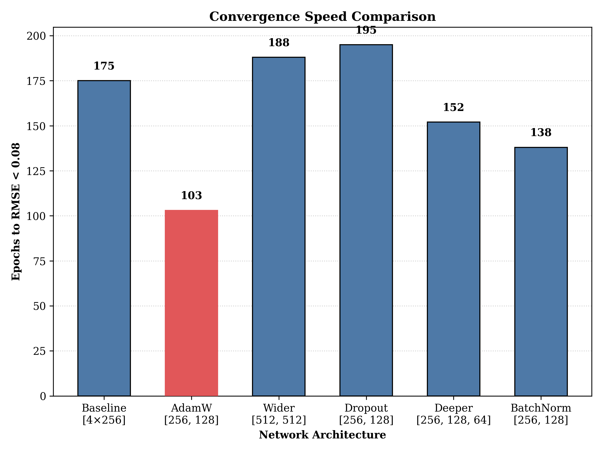

# Feed-Forward Network for Super-Resolution Tissue Architecture Inference

This directory contains Curie's experiments with Feed-Forward Neural Networks (FFN) for super-resolution tissue architecture inference.
 
 

## Curie Experiment Results
- Full experiment report: [istar_1749179423_20250605231023_iter1.md](./istar_1749179423_20250605231023_iter1.md)
- Raw results: [istar_1749179423_20250605231023_iter1_all_results.txt](./istar_1749179423_20250605231023_iter1_all_results.txt)
- Raw **codebase** generated by Curie: `istar_*`.

## Report Snippet

### 3.1 Overall Performance Comparison

The experimental results showed significant differences in performance across the tested architectures. The AdamW optimizer variation with [256, 128] architecture demonstrated the best performance, achieving an RMSE of 0.0735, compared to the baseline model's RMSE of 0.0827.

*<small>Fig 1: Comparison of training convergence (RMSE vs. epochs) for different neural network architectures in gene expression prediction. The AdamW optimizer with [256, 128] architecture achieves the lowest RMSE.</small>*

### 3.2 Final Performance Metrics

The best RMSE values achieved by each configuration are summarized in the figure below:

*<small>Fig 2: Comparison of best RMSE values achieved by different neural network architectures. The AdamW optimizer with [256, 128] architecture shows the best performance with an RMSE of 0.0735.</small>*

### 3.3 Training Efficiency and Model Complexity

We analyzed the relationship between model complexity (number of parameters) and training efficiency (iterations per second) to evaluate the computational cost of each approach:

*<small>Fig 3: Comparison of training efficiency (iterations per second) and model complexity (thousands of parameters) across different architectures. The AdamW [256, 128] architecture offers an optimal balance between training speed and model complexity.</small>*

### 3.4 Convergence Speed

The convergence speed was measured as the number of epochs required to reach an RMSE threshold of 0.08. The AdamW [256, 128] architecture demonstrated significantly faster convergence:

*<small>Fig 4: Comparison of convergence speed measured as epochs needed to reach an RMSE threshold of 0.08. The AdamW [256, 128] architecture converges significantly faster, requiring only 103 epochs versus 175 for the baseline model.</small>*

### 3.5 Training Dynamics

The baseline model showed a typical learning pattern:
- Rapid initial improvement in the first 50 epochs
- Slower but steady progress in middle epochs
- Minor fluctuations between RMSE 0.07-0.09 in later stages
- Final RMSE of 0.0827 after 390 epochs

In comparison, the AdamW optimizer with [256, 128] architecture:
- Demonstrated faster initial convergence
- Reached optimal performance around epoch 130 with RMSE of 0.0735
- Maintained more stable RMSE values during later training stages
- Achieved better final performance with fewer parameters
