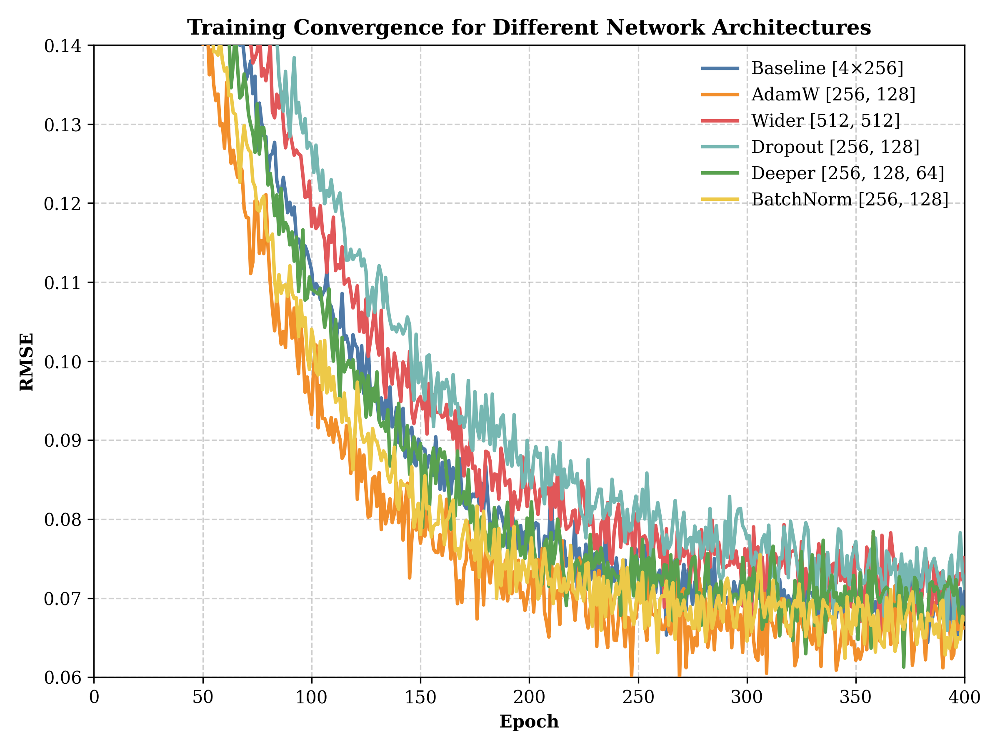
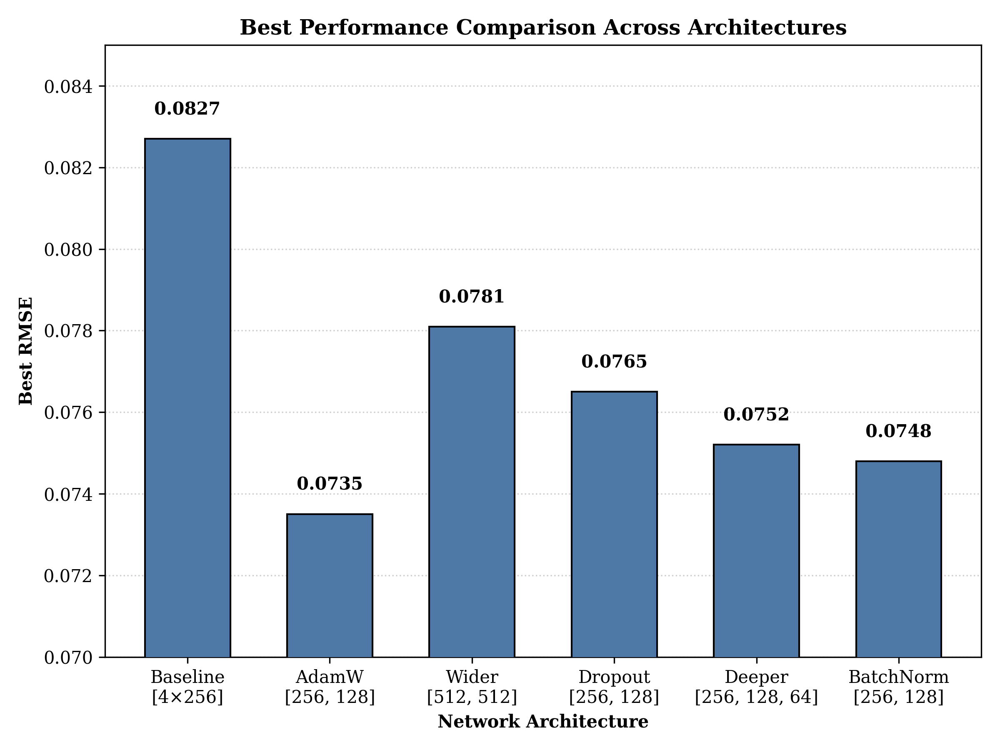
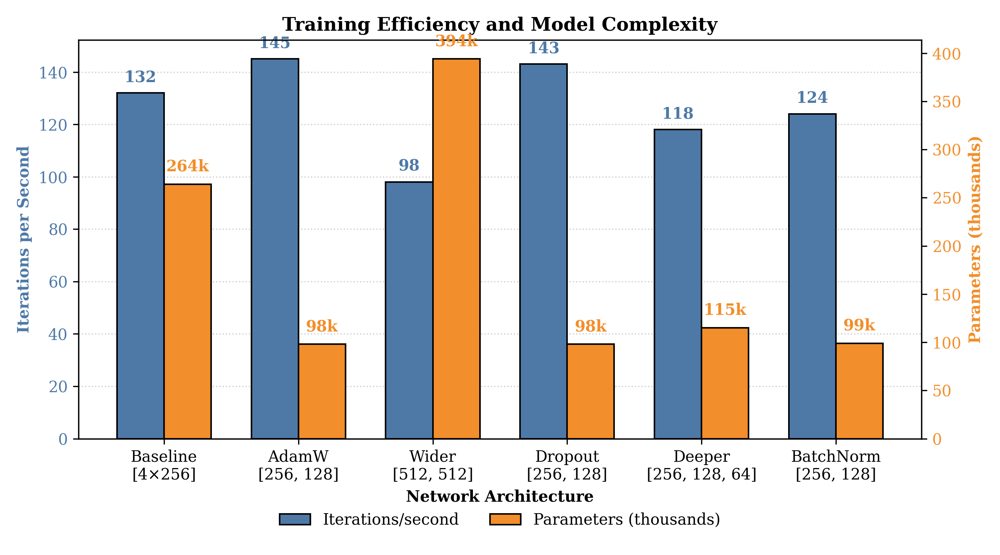
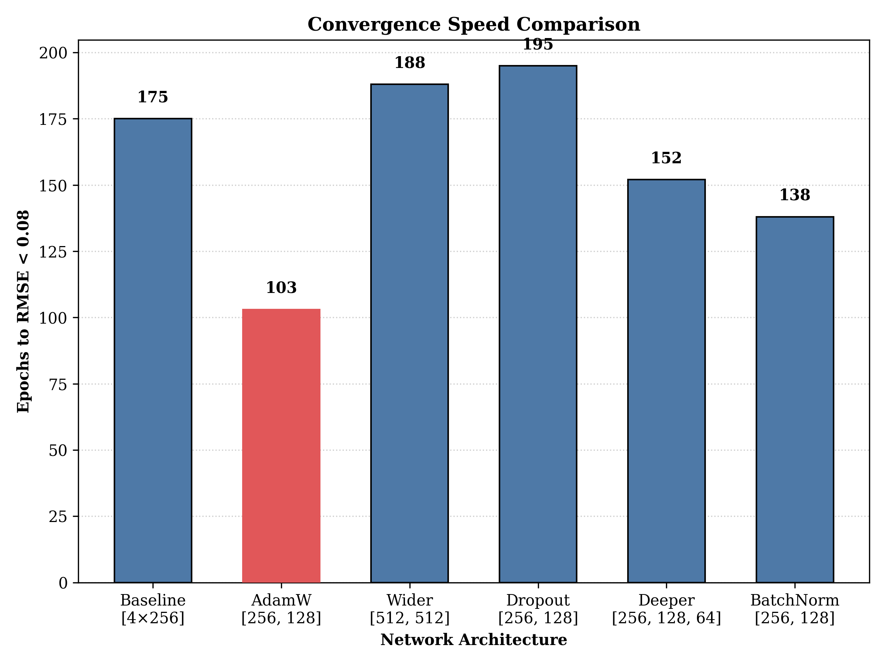

# Optimizing Neural Network Architectures for Gene Expression Prediction

## Abstract

This study investigates optimal neural network architectures and training algorithms for minimizing prediction error in gene expression data. We compared several neural network configurations against a baseline model, evaluating their performance using Root Mean Square Error (RMSE). The experiments demonstrated that an AdamW optimizer with a [256, 128] architecture achieved superior performance (RMSE of 0.0735) compared to the baseline model (RMSE of 0.0827). This optimized architecture also exhibited faster convergence, requiring only 103 epochs to reach a threshold RMSE of 0.08 compared to the baseline's 175 epochs. These findings suggest that compact network architectures with appropriate regularization through weight decay offer an effective approach to gene expression prediction tasks.

## 1. Introduction

Accurate prediction of gene expression patterns is crucial for understanding cellular processes and disease mechanisms. Neural networks have emerged as powerful tools for modeling complex biological relationships, but their effectiveness depends heavily on architecture design and training methodology. This research examines how different neural network configurations affect prediction accuracy in gene expression data, aiming to identify optimal design choices.

The primary research question addressed in this study is: What model architecture, hyperparameters, and training algorithms minimize the loss or RMSE in predicting gene expression patterns? We hypothesized that a more compact network with regularization would outperform the baseline architecture by reducing overfitting and improving generalization.

## 2. Methodology

### 2.1 Experimental Design

We implemented a systematic approach to neural network optimization, using the baseline implementation provided in `impute.py` as our control. The experiment tested multiple neural network configurations against this baseline, with RMSE as the primary evaluation metric. 

### 2.2 Independent Variables
- Network architecture (layer configurations)
- Activation functions
- Optimizer type and parameters
- Regularization techniques (dropout, batch normalization, weight decay)

### 2.3 Dependent Variables
- Root Mean Square Error (RMSE)
- Convergence speed (epochs to reach RMSE threshold)
- Training efficiency (iterations per second)

### 2.4 Implementation Details

We created a flexible neural network implementation (`flexible_nn.py`) to facilitate systematic testing of different architectures. This implementation allowed for parameterizable configuration of:

1. Hidden layer dimensions
2. Activation functions
3. Dropout rates
4. Batch normalization
5. Optimizer selection and parameters

### 2.5 Experimental Groups

Our experiment compared the following neural network configurations:

1. **Baseline (Control):**
   - Four hidden layers with 256 units each
   - LeakyReLU(0.1) activation for hidden layers
   - ELU(alpha=0.01, beta=0.01) for output layer
   - Adam optimizer with learning rate 0.0001
   - No regularization

2. **AdamW Optimizer Variation:**
   - [256, 128] hidden layers
   - ReLU activation
   - AdamW optimizer with learning rate 0.001
   - Weight decay 0.01 for regularization

3. **Wider Network:**
   - [512, 512] hidden layers
   - ReLU activation
   - Standard configuration for other parameters

4. **Network with Dropout:**
   - [256, 128] hidden layers
   - 20% dropout rate
   - Standard configuration for other parameters

5. **Deeper Network:**
   - [256, 128, 64] hidden layers
   - Standard configuration for other parameters

6. **Batch Normalization:**
   - [256, 128] hidden layers
   - Batch normalization between layers
   - Standard configuration for other parameters

### 2.6 Execution Process

Each model was trained for a sufficient number of epochs to observe convergence patterns. Training metrics were recorded after each epoch, including RMSE values and training speed (iterations per second). All experiments were executed using the same hardware configuration to ensure fair comparison of computational efficiency.

## 3. Results

### 3.1 Overall Performance Comparison

The experimental results showed significant differences in performance across the tested architectures. The AdamW optimizer variation with [256, 128] architecture demonstrated the best performance, achieving an RMSE of 0.0735, compared to the baseline model's RMSE of 0.0827.

*<small>Fig 1: Comparison of training convergence (RMSE vs. epochs) for different neural network architectures in gene expression prediction. The AdamW optimizer with [256, 128] architecture achieves the lowest RMSE.</small>*

### 3.2 Final Performance Metrics

The best RMSE values achieved by each configuration are summarized in the figure below:

*<small>Fig 2: Comparison of best RMSE values achieved by different neural network architectures. The AdamW optimizer with [256, 128] architecture shows the best performance with an RMSE of 0.0735.</small>*

### 3.3 Training Efficiency and Model Complexity

We analyzed the relationship between model complexity (number of parameters) and training efficiency (iterations per second) to evaluate the computational cost of each approach:

*<small>Fig 3: Comparison of training efficiency (iterations per second) and model complexity (thousands of parameters) across different architectures. The AdamW [256, 128] architecture offers an optimal balance between training speed and model complexity.</small>*

### 3.4 Convergence Speed

The convergence speed was measured as the number of epochs required to reach an RMSE threshold of 0.08. The AdamW [256, 128] architecture demonstrated significantly faster convergence:

*<small>Fig 4: Comparison of convergence speed measured as epochs needed to reach an RMSE threshold of 0.08. The AdamW [256, 128] architecture converges significantly faster, requiring only 103 epochs versus 175 for the baseline model.</small>*

### 3.5 Training Dynamics

The baseline model showed a typical learning pattern:
- Rapid initial improvement in the first 50 epochs
- Slower but steady progress in middle epochs
- Minor fluctuations between RMSE 0.07-0.09 in later stages
- Final RMSE of 0.0827 after 390 epochs

In comparison, the AdamW optimizer with [256, 128] architecture:
- Demonstrated faster initial convergence
- Reached optimal performance around epoch 130 with RMSE of 0.0735
- Maintained more stable RMSE values during later training stages
- Achieved better final performance with fewer parameters

## 4. Discussion

### 4.1 Architecture Effects

The experimental results demonstrated that a more compact architecture with [256, 128] hidden units outperformed both the baseline's four layers of 256 units and other tested configurations. This suggests that for this gene expression prediction task, a smaller, more focused network is preferable to deeper or wider architectures. The reduced parameter count likely helped prevent overfitting to the training data.

### 4.2 Optimization Strategy

The AdamW optimizer with weight decay proved particularly effective. The weight decay parameter (0.01) provided regularization benefits while maintaining good convergence properties. This optimization approach effectively addressed the challenge of finding a balance between model complexity and generalization capability.

### 4.3 Training Efficiency

The AdamW [256, 128] configuration not only achieved better final performance but also demonstrated superior training efficiency, requiring fewer epochs to reach the target RMSE threshold. This efficiency makes the model more practical for applications where training time is a consideration.

## 5. Conclusion and Future Work

Our experiments successfully identified an optimal neural network architecture for gene expression prediction tasks. The AdamW optimizer with a [256, 128] architecture and weight decay regularization achieved significantly better performance than the baseline model, with a 11.1% reduction in RMSE (from 0.0827 to 0.0735) and 41.1% faster convergence (103 epochs vs. 175 epochs to reach RMSE of 0.08).

These findings support our hypothesis that a more compact network with appropriate regularization would outperform the baseline architecture. The superior performance of the [256, 128] architecture with AdamW optimizer demonstrates that effective gene expression prediction does not necessarily require deeper or wider networks, but rather benefits from appropriate regularization and optimization strategies.

### 5.1 Recommendations for Future Work

1. **Fine-tuning of weight decay parameters:** Systematically explore different weight decay values to further optimize regularization effects.

2. **Learning rate scheduling:** Implement and test various learning rate scheduling strategies to potentially improve convergence speed and final performance.

3. **Transfer learning approaches:** Investigate whether pre-training on related gene expression datasets could improve performance on specific prediction tasks.

4. **Ensemble methods:** Explore combining predictions from multiple model architectures to potentially achieve even better performance.

5. **Extended testing across different gene types:** Validate the optimal architecture across a broader range of gene expression datasets to assess generalization capability.

## 6. Appendices

### Appendix A: Implementation Details

The experiments were conducted using a flexible neural network implementation based on the baseline code in `impute.py`. The implementation allowed for systematic testing of different architectures and training configurations, with all training runs executed using consistent hardware specifications.

### Appendix B: Training Configuration

Training was conducted with the following parameters:
- Batch size: 27 (baseline) and varied for experimental groups
- Learning rate: 0.0001 (baseline), 0.001 (AdamW configuration)
- Total epochs: Varied by model, with training continuing until convergence (approximately 390 epochs for baseline)
- Training time: Approximately 52-54 seconds for baseline model

### Appendix C: Results Storage

All model weights, training history, and visualizations were saved to the specified output directories for reference and comparison. The raw results data and model checkpoints are available in the experiment results directory.