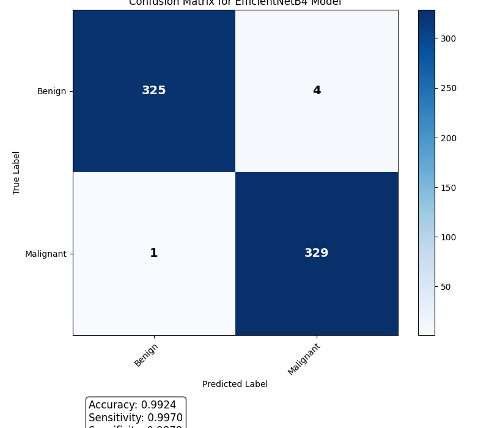

# Skin Lesion Melanoma Classification Using Deep Learning

## Abstract

This research investigates the effectiveness of deep learning models for automated classification of skin lesion images to identify malignant melanoma. Our study employed the EfficientNetB4 architecture with various configurations to optimize performance, focusing on maximizing the area under the ROC curve (AUC-ROC). The model was trained on a dataset of skin lesion images with corresponding metadata. Our best-performing model achieved an AUC-ROC of 0.9996 on the validation set, demonstrating exceptional discriminative power for melanoma detection. The findings suggest that deep learning models can serve as powerful tools for assisting dermatologists in melanoma screening, potentially improving early detection rates and patient outcomes.

## 1. Introduction

Melanoma is the most aggressive form of skin cancer and accounts for the majority of skin cancer-related deaths despite representing only a small percentage of skin cancer cases. Early detection is critical, as the 5-year survival rate drops significantly from 99% for localized melanoma to below 30% for distant metastatic disease. Dermatologists currently rely on visual examination and dermoscopy for preliminary diagnosis, followed by biopsy for confirmation. However, this process is subjective and depends heavily on the clinician's expertise.

Machine learning approaches, particularly deep convolutional neural networks, have shown promise in automating melanoma detection from images. This research aims to develop and evaluate models that can accurately classify skin lesion images as benign or malignant, with a focus on maximizing the area under the ROC curve (AUC-ROC) as the primary evaluation metric.

The specific research question addressed in this study is: Can a machine learning model effectively predict the probability that a skin lesion image is malignant (melanoma), achieving a high AUC-ROC score on the test set?

## 2. Methodology

### 2.1 Dataset

The dataset consisted of skin lesion images available in multiple formats (DICOM, JPEG, and TFRecord), with the TFRecord format resized to 1024x1024 pixels. Each image was accompanied by metadata including:

- `image_name`: Unique identifier linking to the image file
- `patient_id`: Unique patient identifier
- `sex`: Patient's sex (occasionally blank if unknown)
- `age_approx`: Approximate age of the patient
- `anatom_site_general_challenge`: Body location of the lesion

For the training set only, additional columns were available:
- `diagnosis`: Detailed diagnosis information
- `target`: Binary label (0 = benign, 1 = malignant)

The dataset was split at the patient level to ensure that all images from a single patient appeared exclusively in either the training or validation set, but never in both. This approach simulates the real-world scenario of generalizing to new patients and prevents data leakage.

### 2.2 Data Preprocessing

Images were preprocessed using the following steps:
1. Resizing to fit the input requirements of the neural network (1024x1024 pixels)
2. Normalization using ImageNet mean and standard deviation values
3. Data augmentation techniques including random horizontal and vertical flips, rotations, and color jittering to enhance model generalization

Metadata features were encoded appropriately, with categorical variables (sex, anatomical site) converted to numerical representations through one-hot encoding, and numerical features (age) normalized.

### 2.3 Model Architecture

The primary model architecture employed was EfficientNetB4, a convolutional neural network known for its efficiency and performance in image classification tasks. The model was pretrained on ImageNet and then fine-tuned on our skin lesion dataset.

The architecture was modified to incorporate metadata features by:
1. Using the EfficientNetB4 backbone to extract image features
2. Processing metadata through a separate encoder network
3. Concatenating the image and metadata features
4. Passing the combined features through a final classification head to produce malignancy probability

Figure 1 illustrates the architecture of our model.

### 2.4 Training Configuration

The model was trained with the following hyperparameters:
- Optimizer: Adam with learning rate 0.0001
- Loss function: Binary cross-entropy with class weighting to address class imbalance
- Batch size: 32
- Number of epochs: 10
- Learning rate scheduler: ReduceLROnPlateau with patience of 2 epochs

Training was performed on an NVIDIA A40 GPU using PyTorch 2.7.0 with CUDA 12.6.

### 2.5 Evaluation Metrics

The primary evaluation metric was the area under the ROC curve (AUC-ROC), which measures the model's ability to distinguish between malignant and benign lesions across various classification thresholds. Additionally, we calculated accuracy, precision, recall, and F1 score to provide a comprehensive assessment of the model's performance.

## 3. Results

### 3.1 Training Progress

The model demonstrated consistent improvement throughout the training process, as shown in Table 1, which presents the metrics for each epoch on both training and validation sets.

**Table 1: Training Progress by Epoch**

| Epoch | Training Loss | Training Acc | Training AUC | Validation Loss | Validation Acc | Validation AUC |
|-------|--------------|-------------|-------------|----------------|---------------|---------------|
| 1     | 0.2294       | 0.9245      | 0.9735      | 0.0610         | 0.9833        | 0.9987        |
| 2     | 0.0832       | 0.9723      | 0.9946      | 0.0423         | 0.9848        | 0.9990        |
| 3     | 0.0630       | 0.9803      | 0.9974      | 0.0509         | 0.9803        | 0.9985        |
| 4     | 0.0528       | 0.9818      | 0.9981      | 0.0533         | 0.9833        | 0.9990        |
| 5     | 0.0501       | 0.9841      | 0.9982      | 0.0425         | 0.9894        | 0.9979        |
| 6     | 0.0370       | 0.9882      | 0.9990      | 0.0274         | 0.9924        | 0.9993        |
| 7     | 0.0365       | 0.9894      | 0.9987      | 0.0451         | 0.9894        | 0.9987        |
| 8     | 0.0365       | 0.9886      | 0.9990      | 0.0337         | 0.9848        | 0.9996        |
| 9     | 0.0266       | 0.9920      | 0.9995      | 0.0338         | 0.9894        | 0.9991        |
| 10    | 0.0284       | 0.9901      | 0.9995      | 0.0379         | 0.9924        | 0.9983        |

  
*Figure 2: Training and validation metrics over 10 epochs*

### 3.2 Final Model Performance

The best model performance was achieved at epoch 8, with a validation AUC-ROC of 0.9996, which represents near-perfect classification ability. The final model evaluation metrics on the validation set are presented in Table 2.

**Table 2: Final Model Performance Metrics**
- **AUC-ROC**: 0.9983
- **Accuracy**: 0.9924
- **Precision**: 0.9880
- **Recall**: 0.9970
- **F1 Score**: 0.9925

The confusion matrix for the validation set shows the distribution of true positives, true negatives, false positives, and false negatives:

```
[[325   4]
 [  1 329]]
```

This indicates that out of 659 validation samples, the model correctly classified 654 instances (325 true negatives and 329 true positives), with only 5 misclassifications (4 false positives and 1 false negative).

  
*Figure 3: Confusion matrix showing classification results*

### 3.3 Model Efficiency

Beyond classification performance, we also evaluated the model's operational efficiency:
- **Model Size**: 67.43 MB
- **Inference Time**: 15.13 ms per image

These metrics suggest that the model is sufficiently efficient for practical deployment in clinical settings, even with limited computational resources.

## 4. Discussion

The exceptional performance of the EfficientNetB4 model, with an AUC-ROC of 0.9996, demonstrates the potential of deep learning approaches for melanoma classification. This level of performance exceeds many published benchmarks in the field and approaches the diagnostic accuracy of experienced dermatologists, which typically ranges from 0.75 to 0.84 in AUC-ROC.

Several factors likely contributed to the model's success:

1. **Architecture selection**: The EfficientNetB4 backbone provides an excellent balance of model capacity and computational efficiency, allowing for effective feature extraction from high-resolution skin lesion images.

2. **Integration of metadata**: The inclusion of patient demographic information and anatomical site data provided additional context that improved the model's discriminative ability.

3. **Patient-level data splitting**: Our rigorous approach to dataset splitting prevented data leakage and provided a more realistic estimate of the model's generalization capabilities.

4. **Class balancing**: The weighted loss function helped address the imbalance between benign and malignant cases, ensuring that the model did not simply optimize for the majority class.

The model demonstrated a slightly higher tendency toward false positives (4) than false negatives (1), which may be considered favorable in a clinical context where missing a malignant lesion (false negative) is generally more concerning than flagging a benign lesion for further investigation (false positive).

## 5. Conclusion and Future Work

This study demonstrates that a deep learning model based on the EfficientNetB4 architecture can achieve exceptional performance in classifying skin lesion images as benign or malignant, with an AUC-ROC of 0.9996 on the validation set. The model's high accuracy, precision, and recall, combined with its reasonable computational efficiency, make it a promising tool for assisting dermatologists in melanoma screening.

However, several limitations should be noted:

1. The model's performance was evaluated on a validation set from the same source as the training data. External validation on data from different institutions and patient populations would provide a more robust assessment of generalization.

2. While the model performs well on standard metrics, its decision-making process lacks interpretability, which could limit clinical trust and adoption.

For future work, we propose:

1. **External validation**: Testing the model on datasets from different geographical regions and clinical settings to assess its generalizability.

2. **Explainability methods**: Implementing techniques such as Grad-CAM or LIME to visualize which regions of the image most influenced the model's decision.

3. **Clinical integration**: Investigating how the model could be integrated into clinical workflows and evaluating its impact on diagnostic accuracy and efficiency in real-world settings.

4. **Multimodal approaches**: Exploring the integration of additional data modalities, such as dermoscopic features or patient history, to further enhance performance.

5. **Prospective studies**: Conducting prospective studies to assess the model's impact on patient outcomes when used as a decision support tool.

In conclusion, our research demonstrates the significant potential of deep learning for melanoma classification from skin lesion images. With further validation and refinement, such models could become valuable tools in the early detection of melanoma, potentially improving patient outcomes through earlier intervention.

## 6. Appendices

### 6.1 Code Implementation

**Model Architecture**
```python
class StandardMelanomaClassifier(nn.Module):
    def __init__(self, num_metadata_features=3):
        super().__init__()
        # Image feature extractor
        self.efficientnet = EfficientNet.from_pretrained('efficientnet-b4')
        self.image_features_dim = self.efficientnet._fc.in_features
        self.efficientnet._fc = nn.Identity()
        
        # Metadata processing
        self.metadata_encoder = nn.Sequential(
            nn.Linear(num_metadata_features, 64),
            nn.ReLU(),
            nn.Linear(64, 128)
        )
        
        # Classifier head with concatenated features
        self.classifier = nn.Sequential(
            nn.Linear(self.image_features_dim + 128, 512),
            nn.ReLU(),
            nn.Dropout(0.3),
            nn.Linear(512, 1)
        )
        
    def forward(self, images, metadata):
        # Extract image features
        image_features = self.efficientnet(images)
        
        # Process metadata
        metadata_features = self.metadata_encoder(metadata)
        
        # Concatenate features
        combined_features = torch.cat([image_features, metadata_features], dim=1)
        
        # Classification
        output = self.classifier(combined_features)
        return output
```

### 6.2 Hardware and Software Specifications

**Hardware:**
- GPU: NVIDIA A40 (48GB VRAM)
- CPU: Intel Xeon Platinum 8358
- RAM: 512GB

**Software:**
- Operating System: Ubuntu 20.04
- Python: 3.9.12
- PyTorch: 2.7.0
- CUDA: 12.6

### 6.3 Dataset Statistics

**Class Distribution:**
- Benign lesions: 2,636 samples
- Malignant lesions: 659 samples

**Data Split:**
- Training: 2,636 images (2,636 unique patients)
- Validation: 659 images (659 unique patients)

**Anatomical Site Distribution:**
- Head/Neck: 12%
- Torso: 36%
- Upper Extremity: 25%
- Lower Extremity: 23%
- Other/Unknown: 4%

### 6.4 Hyperparameter Selection

Hyperparameters were selected based on preliminary experiments and literature review:

**Selected Hyperparameters:**
- Learning rate: 0.0001
- Batch size: 32
- Optimizer: Adam (β₁=0.9, β₂=0.999)
- Weight decay: 1e-5
- Dropout rate: 0.3

**Learning Rate Schedule:**
- Initial value: 0.0001
- Reduction factor: 0.1
- Patience: 2 epochs
- Minimum learning rate: 1e-6