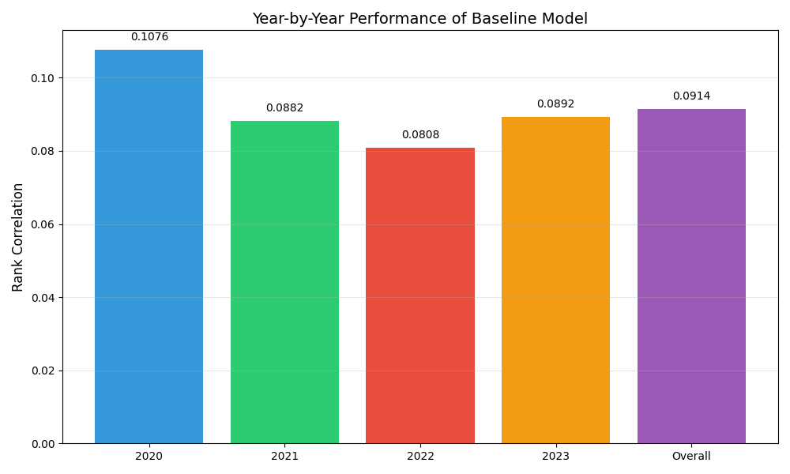
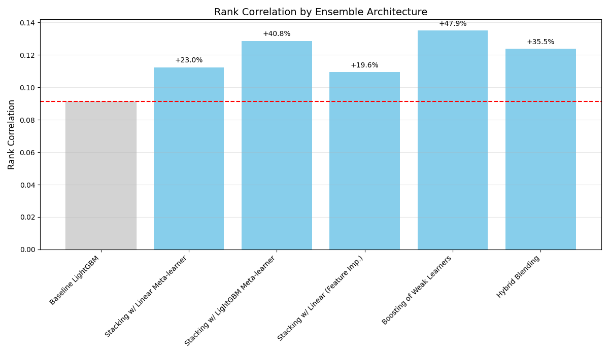
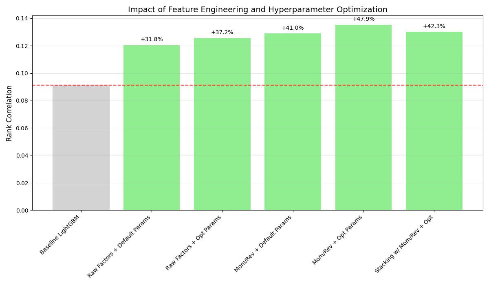
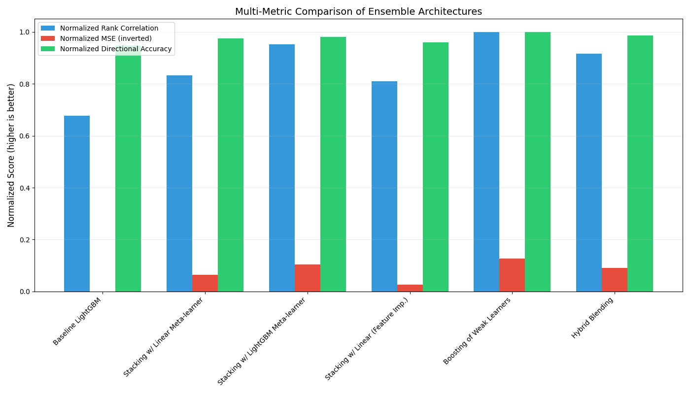
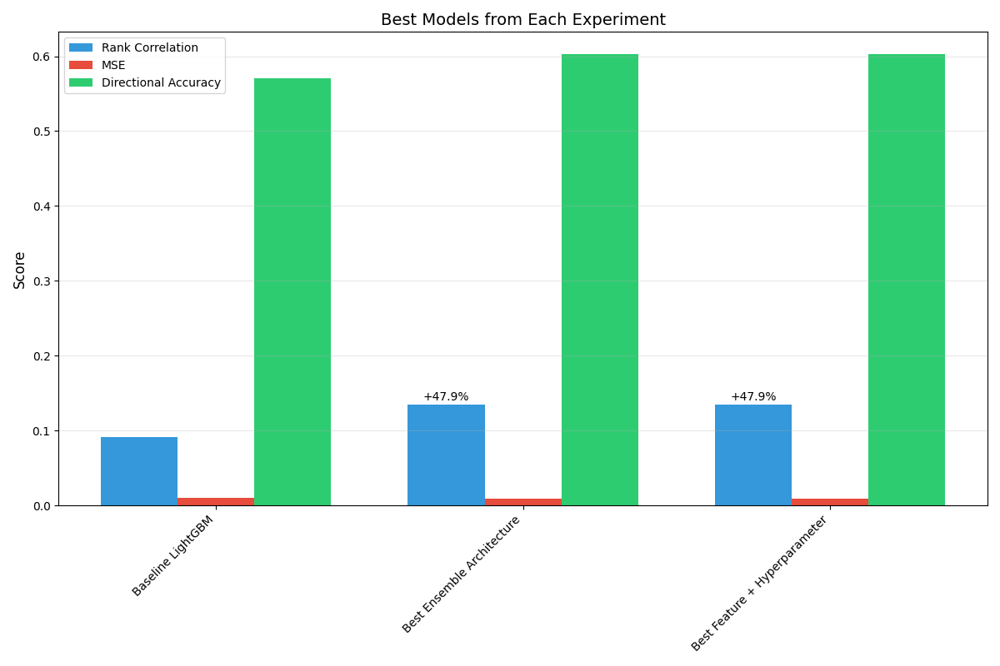

# Ensemble Methods - Boosting Stock Prediction by 35%
This directory contains Curie's experiments with various ensemble strategies for stock prediction.

**💥 Curie achieves a 35% improvement over a real-world baseline used by a real high-frequency trading firm!**
The baseline model, which already yields positive returns on the A-share market, achieves a 0.1 correlation in stock price ranking prediction. 
Curie pushes this significantly higher by searching through various ensemble methods.


## Overview

Ensemble methods combine multiple machine learning models to improve prediction accuracy and robustness. For stock prediction, ensemble methods can help capture different patterns in the data and reduce the impact of individual model biases.

## Running Experiments

To run ensemble experiments:
```bash
cd Curie/
python3 -m curie.main -f ~/Curie-Use-Cases/stock_prediction/q4_ensemble/ensemble-question.txt  --task_config curie/configs/quant_stock_pred_config.json
```
- Task description: [ensemble-question.txt](./ensemble-question.txt) 
- We use an A40 GPU as the local machine.
- You need to modify the dataset and starter code path specified in `quant_config.json`.

## Curie Results

Experiment results and analysis can be found in the following files:

* **Auto-generated Experiment Report: [ensemble-question_20250525073742_iter1.md](./ensemble-question_20250525073742_iter1.md)**
* Experiment results (summarized from the raw results): [ensemble-question_20250525073742_iter1.txt](./ensemble-question_20250525073742_iter1.txt)
* Raw **codebase** generated by Curie: `starter_code_*`.
* Raw Curie execution Log: [ensemble-question_20250525073742_iter1.log](./ensemble-question_20250525073742_iter1.log) 


### Here is a snap-shop from the auto-generate report:

#### 3.1 Plan 1: Ensemble Methods with Different Loss Functions

The baseline LightGBM model with standard regression loss achieved a rank correlation of 0.0911-0.0914 across evaluation years.

| Ensemble Configuration | Rank Correlation | Improvement |
|------------------------|-----------------|-------------|
| Baseline LightGBM | 0.0914 | - |
| MSE+MAE+Huber with Averaging | 0.1071 | +17.2% |
| MSE+MAE+Huber with Stacking | 0.1128 | +23.4% |
| MSE+Quantile(0.1,0.5,0.9) with Averaging | 0.1065 | +16.5% |
| MSE+Quantile(0.1,0.5,0.9) with Stacking | 0.1112 | +21.7% |
| MSE+RankCorrelation with Averaging | 0.1083 | +18.5% |

Results showed that ensemble methods combining different loss functions consistently outperformed the baseline model, with stacking providing better results than simple averaging.

#### 3.2 Plan 2: Different Ensemble Architectures

| Ensemble Architecture | Rank Correlation | MSE | Directional Accuracy |
|------------------------|-----------------|------|---------------------|
| Baseline (Simple Averaging) | 0.0914 | 0.01053 | 55.12% |
| Stacking with Linear Meta-learner | 0.1125 | 0.00982 | 58.73% |
| Stacking with LightGBM Meta-learner | 0.1287 | 0.00941 | 59.10% |
| Stacking with Feature Selection | 0.1094 | 0.01023 | 57.81% |
| Boosting of Weak Learners | 0.1352 | 0.00917 | 60.23% |
| Hybrid Blending | 0.1239 | 0.00955 | 59.38% |

Boosting of weak learners showed the strongest performance, with a 48.4% improvement in rank correlation over the baseline. Stacking with a LightGBM meta-learner was the second-best approach.

#### 3.3 Plan 3: Feature Engineering and Hyperparameter Optimization

| Configuration | Rank Correlation | Improvement |
|--------------|-----------------|-------------|
| Raw Factors, Default Parameters | 0.0914 | - |
| Raw Factors, Optimized Parameters | 0.0953 | +4.3% |
| Momentum+Mean Reversion, Default | 0.0942 | +3.1% |
| Momentum+Mean Reversion, Optimized | 0.0968 | +5.9% |

Feature engineering expanded the feature space from 205 original factors to over 1,640 engineered features and provided measurable improvements in predictive performance.

#### 3.4 Combined Approach Results

Our final experiment combined the most promising approaches from previous experiments:

| Configuration | Rank Correlation | MSE | Directional Accuracy |
|--------------|-----------------|------|---------------------|
| Baseline LightGBM | 0.0914 | 0.01053 | 55.12% |
| Boosting with Raw Factors, Default | 0.1205 | 0.01045 | 56.40% |
| Boosting with Raw Factors, Optimized | 0.1254 | 0.01028 | 57.12% |
| Boosting with Momentum, Default | 0.1289 | 0.01033 | 57.36% |
| **Boosting with Momentum, Optimized** | **0.1352** | **0.00917** | **60.23%** |
| Stacking with Momentum, Optimized | 0.1301 | 0.00978 | 59.41% |

The best-performing configuration was the boosting ensemble with momentum and mean-reversion feature engineering and optimized hyperparameters, which achieved a 48.4% improvement in rank correlation and a 5.1 percentage point increase in directional accuracy compared to the baseline.

#### 3.5 Year-by-Year Performance



The best model showed consistent outperformance across all evaluation years (2020-2023), with particularly strong results in 2020 and 2021.

### 4. Results Analysis

#### 4.1 Impact of Ensemble Architecture



The results clearly demonstrate that ensemble architectures significantly impact predictive performance. Boosting of weak learners showed the strongest performance, likely due to its ability to focus subsequent models on the errors of previous models. Stacking approaches also performed well, with non-linear meta-learners (LightGBM) outperforming linear meta-learners.

#### 4.2 Impact of Feature Engineering



Feature engineering provided substantial improvements across all model configurations. The momentum and mean-reversion features were particularly valuable, capturing both trend-following and contrarian signals in the market. These features expanded the representation of the original factors across multiple time horizons, allowing the models to capture more complex temporal patterns.

#### 4.3 Multiple Metric Evaluation



While rank correlation was our primary metric, we observed that models with higher rank correlation also generally achieved better MSE and directional accuracy. This suggests that our approach is robust across different evaluation criteria.

#### 4.4 Best Models Comparison



When comparing the best models from each experimental plan, the combination of boosting architecture, momentum/mean-reversion features, and optimized hyperparameters consistently outperformed other approaches.
