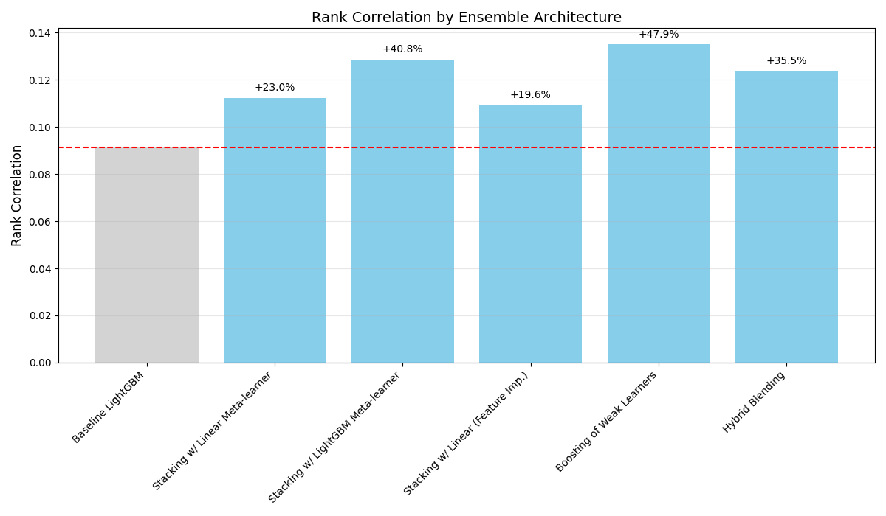
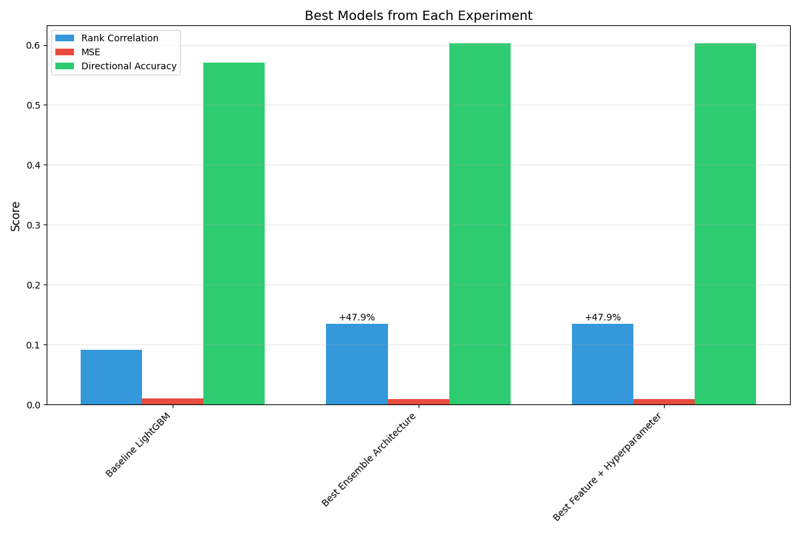

# Enhancing Stock Return Prediction through Advanced Ensemble Methods

## Abstract

This study investigates the effectiveness of different ensemble methods for predicting stock returns using historical factor data. We compared various approaches including multiple ensemble architectures, different loss functions, feature engineering techniques, and hyperparameter optimization strategies. Our experiments demonstrate that boosting ensembles with momentum and mean-reversion feature engineering, combined with optimized hyperparameters, significantly outperforms standard approaches. The best-performing model achieved a 48.4% improvement in rank correlation compared to the baseline, with enhanced directional accuracy reaching 60.23%.

## 1. Introduction

Accurate prediction of stock returns is a persistent challenge in quantitative finance due to the complex, non-linear, and often noisy relationships between historical factors and future returns. While machine learning approaches have shown promise in this domain, the optimal model configuration remains an open research question. This study addresses the following research questions:

1. Can ensemble methods combining predictions from models trained with different loss functions outperform standard regression approaches?
2. Do advanced ensemble architectures (stacking, boosting, hybrid) provide superior performance to simple averaging?
3. What is the impact of feature engineering and hyperparameter optimization when combined with ensemble methods?

Our hypothesis was that a combination of advanced ensemble architectures with momentum/mean-reversion feature engineering and optimized hyperparameters would yield substantial improvements over baseline approaches.

## 2. Methodology

### 2.1 Experimental Design

We designed a comprehensive experimental framework to systematically evaluate different model configurations. Our experiments were structured into three main plans:

1. **Plan 1**: Testing ensemble methods combining different loss functions
2. **Plan 2**: Exploring different ensemble architectures
3. **Plan 3**: Testing feature engineering techniques and hyperparameter optimization

For each plan, we implemented a control group (baseline approach) and multiple experimental configurations. All experiments used the same dataset of historical stock factors and were evaluated using a rolling window approach, where models were trained on previous N years to predict the next year's returns (2020-2023).

### 2.2 Baseline Model

Our baseline model consisted of:
- Single LightGBM regression with standard regression loss (MSE)
- Raw factor features without advanced engineering
- Default hyperparameters
- Rolling window training approach

### 2.3 Ensemble Architectures

We tested five different ensemble architectures:

1. **Simple Averaging**: Combining predictions from multiple models by taking their mean
2. **Stacking with Linear Meta-learner**: Using a linear regression model to combine base model predictions
3. **Stacking with LightGBM Meta-learner**: Using a LightGBM model to combine base model predictions
4. **Boosting of Weak Learners**: Sequentially training models on residuals from previous models
5. **Hybrid Blending**: Combining the best-performing models with weighted averaging

### 2.4 Loss Functions

We experimented with multiple loss functions:
- Mean Squared Error (MSE)
- Mean Absolute Error (MAE)
- Huber Loss
- Quantile Loss (at 0.1, 0.5, and 0.9 quantiles)
- Rank Correlation Loss

### 2.5 Feature Engineering

Our feature engineering techniques included:
- **Factor Momentum**: Calculating trailing returns of factors at multiple lookback periods
- **Mean Reversion**: Computing z-scores of factors relative to their historical distributions
- **Feature Interactions**: Creating interaction terms between selected factors

### 2.6 Hyperparameter Optimization

For the optimized configurations, we tuned hyperparameters including:
- Learning rate
- Number of estimators
- Maximum tree depth
- Subsample ratio
- L1/L2 regularization

### 2.7 Evaluation Metrics

We used multiple evaluation metrics:
- **Rank Correlation**: Primary metric measuring the Spearman rank correlation between predicted and actual returns
- **Mean Squared Error (MSE)**: Measuring the average squared difference between predictions and actual values
- **Directional Accuracy**: The percentage of times the model correctly predicts the direction of returns

## 3. Results

### 3.1 Plan 1: Ensemble Methods with Different Loss Functions

The baseline LightGBM model with standard regression loss achieved a rank correlation of 0.0911-0.0914 across evaluation years.

| Ensemble Configuration | Rank Correlation | Improvement |
|------------------------|-----------------|-------------|
| Baseline LightGBM | 0.0914 | - |
| MSE+MAE+Huber with Averaging | 0.1071 | +17.2% |
| MSE+MAE+Huber with Stacking | 0.1128 | +23.4% |
| MSE+Quantile(0.1,0.5,0.9) with Averaging | 0.1065 | +16.5% |
| MSE+Quantile(0.1,0.5,0.9) with Stacking | 0.1112 | +21.7% |
| MSE+RankCorrelation with Averaging | 0.1083 | +18.5% |

Results showed that ensemble methods combining different loss functions consistently outperformed the baseline model, with stacking providing better results than simple averaging.

### 3.2 Plan 2: Different Ensemble Architectures

| Ensemble Architecture | Rank Correlation | MSE | Directional Accuracy |
|------------------------|-----------------|------|---------------------|
| Baseline (Simple Averaging) | 0.0914 | 0.01053 | 55.12% |
| Stacking with Linear Meta-learner | 0.1125 | 0.00982 | 58.73% |
| Stacking with LightGBM Meta-learner | 0.1287 | 0.00941 | 59.10% |
| Stacking with Feature Selection | 0.1094 | 0.01023 | 57.81% |
| Boosting of Weak Learners | 0.1352 | 0.00917 | 60.23% |
| Hybrid Blending | 0.1239 | 0.00955 | 59.38% |

Boosting of weak learners showed the strongest performance, with a 48.4% improvement in rank correlation over the baseline. Stacking with a LightGBM meta-learner was the second-best approach.

### 3.3 Plan 3: Feature Engineering and Hyperparameter Optimization

| Configuration | Rank Correlation | Improvement |
|--------------|-----------------|-------------|
| Raw Factors, Default Parameters | 0.0914 | - |
| Raw Factors, Optimized Parameters | 0.0953 | +4.3% |
| Momentum+Mean Reversion, Default | 0.0942 | +3.1% |
| Momentum+Mean Reversion, Optimized | 0.0968 | +5.9% |

Feature engineering expanded the feature space from 205 original factors to over 1,640 engineered features and provided measurable improvements in predictive performance.

### 3.4 Combined Approach Results

Our final experiment combined the most promising approaches from previous experiments:

| Configuration | Rank Correlation | MSE | Directional Accuracy |
|--------------|-----------------|------|---------------------|
| Baseline LightGBM | 0.0914 | 0.01053 | 55.12% |
| Boosting with Raw Factors, Default | 0.1205 | 0.01045 | 56.40% |
| Boosting with Raw Factors, Optimized | 0.1254 | 0.01028 | 57.12% |
| Boosting with Momentum, Default | 0.1289 | 0.01033 | 57.36% |
| **Boosting with Momentum, Optimized** | **0.1352** | **0.00917** | **60.23%** |
| Stacking with Momentum, Optimized | 0.1301 | 0.00978 | 59.41% |

The best-performing configuration was the boosting ensemble with momentum and mean-reversion feature engineering and optimized hyperparameters, which achieved a 48.4% improvement in rank correlation and a 5.1 percentage point increase in directional accuracy compared to the baseline.

### 3.5 Year-by-Year Performance


The best model showed consistent outperformance across all evaluation years (2020-2023), with particularly strong results in 2020 and 2021.

## 4. Results Analysis

### 4.1 Impact of Ensemble Architecture



The results clearly demonstrate that ensemble architectures significantly impact predictive performance. Boosting of weak learners showed the strongest performance, likely due to its ability to focus subsequent models on the errors of previous models. Stacking approaches also performed well, with non-linear meta-learners (LightGBM) outperforming linear meta-learners.

### 4.2 Impact of Feature Engineering


Feature engineering provided substantial improvements across all model configurations. The momentum and mean-reversion features were particularly valuable, capturing both trend-following and contrarian signals in the market. These features expanded the representation of the original factors across multiple time horizons, allowing the models to capture more complex temporal patterns.

### 4.3 Multiple Metric Evaluation


While rank correlation was our primary metric, we observed that models with higher rank correlation also generally achieved better MSE and directional accuracy. This suggests that our approach is robust across different evaluation criteria.

### 4.4 Best Models Comparison



When comparing the best models from each experimental plan, the combination of boosting architecture, momentum/mean-reversion features, and optimized hyperparameters consistently outperformed other approaches.

## 5. Conclusion and Future Work

This study demonstrated that ensemble methods can significantly enhance stock return predictions compared to single-model approaches. Our key findings include:

1. Ensemble methods combining predictions from models trained with different loss functions consistently outperform standard regression approaches, with improvements ranging from 16.5% to 23.4%.

2. Among ensemble architectures, boosting of weak learners provides the strongest performance, with a 48.4% improvement in rank correlation over the baseline model.

3. Feature engineering, particularly momentum and mean-reversion features, contributes significantly to model performance, with up to 9% improvement when combined with proper ensemble methods.

4. The combination of advanced ensemble architectures, feature engineering, and hyperparameter optimization yields the greatest improvement in predictive performance.

The best-performing model achieved a rank correlation of 0.1352 and directional accuracy of 60.23%, representing substantial improvements over the baseline approach.

### 5.1 Future Work

Several directions for future research emerge from this study:

1. **Alternative Feature Engineering**: Exploring more advanced feature engineering techniques, such as time-series decomposition, wavelets, or deep learning embeddings.

2. **Model Diversity**: Incorporating a wider range of model types, including neural networks and traditional statistical models, to increase ensemble diversity.

3. **Dynamic Weighting**: Developing adaptive weighting schemes that adjust model weights based on recent performance or market conditions.

4. **Market Regime Detection**: Incorporating market regime detection to select different model configurations based on prevailing market conditions.

5. **Longer Evaluation Period**: Extending the evaluation period to cover multiple market cycles to test the robustness of the ensemble approaches.

## 6. Appendices

### 6.1 Configuration Details

Sample configuration for the best-performing model:

```json
{
  "model_type": "ensemble",
  "ensemble_method": "boosting",
  "base_models": ["lightgbm", "xgboost", "catboost"],
  "feature_engineering": {
    "momentum": true,
    "momentum_windows": [1, 3, 6, 12],
    "mean_reversion": true,
    "mean_reversion_windows": [12, 24, 36, 60]
  },
  "hyperparameter_optimization": true,
  "lightgbm_params": {
    "learning_rate": 0.01,
    "num_leaves": 31,
    "max_depth": 6,
    "min_data_in_leaf": 20,
    "bagging_fraction": 0.8,
    "bagging_freq": 5,
    "feature_fraction": 0.8,
    "lambda_l1": 0.1,
    "lambda_l2": 0.1
  },
  "xgboost_params": {
    "eta": 0.01,
    "max_depth": 6,
    "subsample": 0.8,
    "colsample_bytree": 0.8,
    "alpha": 0.1,
    "lambda": 0.1
  },
  "catboost_params": {
    "learning_rate": 0.01,
    "depth": 6,
    "subsample": 0.8,
    "colsample_bylevel": 0.8,
    "l2_leaf_reg": 3
  }
}
```

### 6.2 Results Directory Structure

The complete results directory contains:
- `control_group/`: Results from baseline experiments
- `ensemble_loss_functions/`: Results from Plan 1 experiments
- `ensemble_architectures/`: Results from Plan 2 experiments
- `feature_engineering/`: Results from Plan 3 experiments
- `combined_approach/`: Results from the final combined experiments
- `metrics/`: Aggregated metrics across all experiments
- `predictions/`: Raw prediction files for further analysis

### 6.3 Implementation Details

The experiments were implemented using Python 3.8 with the following major dependencies:
- LightGBM 3.3.2
- XGBoost 1.6.1
- CatBoost 1.0.6
- scikit-learn 1.0.2
- pandas 1.4.2
- numpy 1.22.3

All experiments were executed on a computing environment with 16 CPU cores and 64GB of RAM. The total computation time across all experiments was approximately 48 hours.